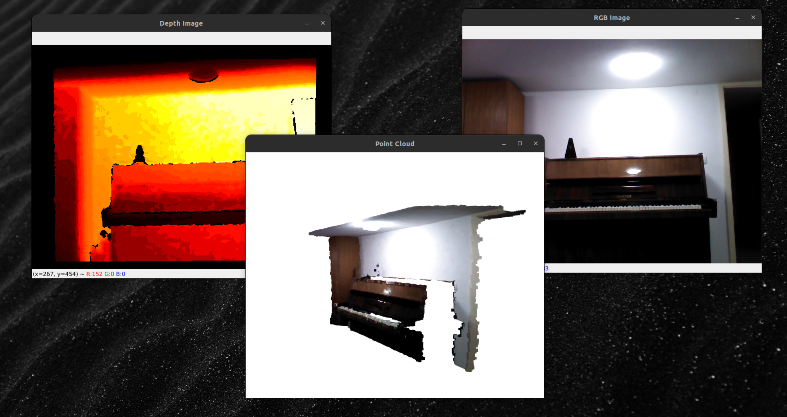

# Astra Pro Point Cloud Demo



## Installation

Follow this guide to install the drivers for the Astra Pro: https://astra-wiki.readthedocs.io/en/latest/downloadDriver.html

Before running the script you have to load the environment from the downloaded driver folder:

```
source ~/OpenNi/OpenNI-Linux-x64-2.3/OpenNIDevEnvironment
```
> You might put this in your `~.bashrc` to automatically set the environment variables in every shell.

Run the script with Python 3
```
python3 main.py
```

> The Open3D library currently supports only Python versions up to 3.9. We recommend using _pyenv_ to switch between versions ([guide](https://realpython.com/intro-to-pyenv/)). You might need to first install the dependencies listed [here](https://github.com/pyenv/pyenv/wiki#suggested-build-environment).